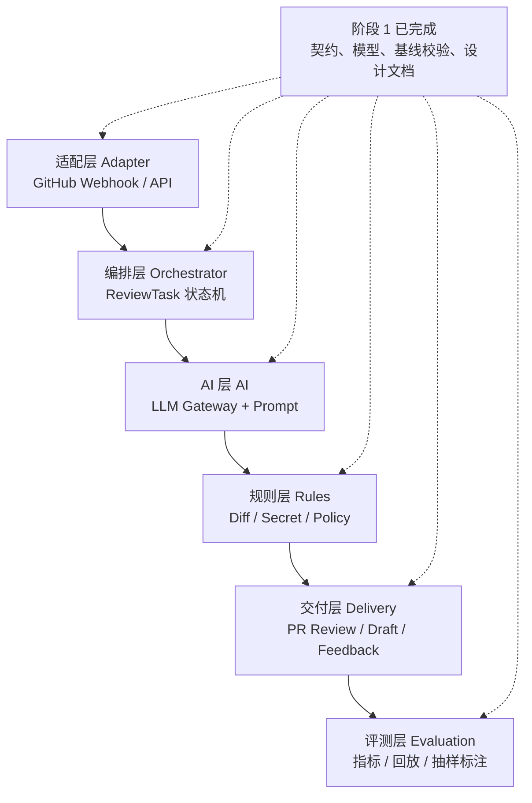

# Contract Review Bot

> 阶段 1：项目蓝图与基线验证

## 项目定位

Contract Review Bot 是一个面向 Pull Request 的、可验证且可审计的 AI Code Review 系统：它不会像 GitHub Copilot/Codex 那样主要负责“生成代码或回答问题”，而是围绕事件契约、确定性规则、证据链、置信度分流和可回放评测，把一次审查变成可追踪、可验收的工程流程。

## 六层系统架构与阶段规划



阶段 1 不宣称线上链路已经可用；它完成的是六层之间的接口契约和可验证的最小基线：领域模型、状态流转、行号映射防御、指标口径、路由策略与安全边界。阶段 2 才接入真实 GitHub App、队列、LLM、持久化和评论回写。

## 目录结构

```text
.
├── packages/models/              # ReviewTask / Finding / Evidence
├── docs/                         # 指标、路由、安全白皮书
├── scripts/                      # 可独立运行的校验脚本
├── tests/fixtures/               # 恶意 Diff 固定样本
├── docker-compose.yml            # 阶段 1 的运行时草案
└── .env.example                  # 环境变量契约
```

## 快速启动（草案）

```bash
cp .env.example .env
# 填入 GitHub App 与 LLM 凭据后再启动
docker compose up --build
```

当前 compose 中的 `api` 与 `worker` 是占位服务，目的是先固定端口、依赖和环境变量契约；真实 Webhook、队列消费和评论回写属于阶段 2。

关键环境变量见[`.env.example`](.env.example)，包括 GitHub App 凭据、Webhook secret、模型名称、输入/输出 token 单价、数据库和 Redis 地址。

## 阶段 1 验收方式

```bash
python -m pytest -q
python scripts/validate_line_mapping.py tests/fixtures/malicious_diff.json
```

预期结果：模型状态机与 Finding 行号校验测试通过；恶意 Diff 的旧文件行号会被映射到新文件行号，删除行不会被直接拿去发布评论。

## 当前进度

- [x] README、电梯游说、六层架构图与阶段规划
- [x] `packages/models/` 领域实体与 `ReviewTask` 状态机
- [x] `docs/metrics.md` 指标口径与验收标准
- [x] `tests/fixtures/malicious_diff.json` 与行号映射防御脚本
- [x] `docs/routing_strategy.md` 置信度分流与流程图
- [x] `docs/security_whitepaper.md` Prompt Injection 防御墙
- [x] 至少一次规范 Git Commit
- [ ] 阶段 2：真实 GitHub Webhook、队列、LLM Gateway 与 PR 回写

