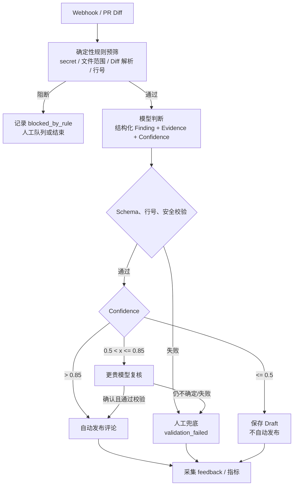

# 置信度分流策略

置信度是模型在结构化输出中给出的 `confidence ∈ [0, 1]`。它不是事实真值，因此在模型判断前必须经过确定性规则预筛，在发布前必须再次做 schema、行号和安全校验。

## 决策规则

| 条件 | 动作 | 结果 |
|---|---|---|
| 规则预筛阻断 | 不调用发布链路 | 保存 `blocked_by_rule`，必要时进入人工队列 |
| `confidence > 0.85` 且所有校验通过 | 自动发布 PR 行内评论 | 写入 `published` 与审计证据 |
| `0.5 < confidence <= 0.85` | 调用一次更贵模型复核；若仍不确定则 Assign Reviewer | 复核通过才发布，否则保存草稿 |
| `confidence <= 0.5` | 不自动发布 | 保存为 Draft，供抽样评测或人工查看 |
| 任意置信度但行号/安全校验失败 | 禁止发布 | `validation_failed`，进入人工兜底 |

边界明确写成代码条件，避免 `0.85` 和 `0.5` 被不同实现解释：只有严格大于 `0.85` 才能直发；等于 `0.85` 进入升级复核；小于等于 `0.5` 保存草稿。

## 完整决策链路

## 人工兜底的输入

人工任务必须看到原始 PR、最小相关上下文、规则命中结果、模型理由、证据摘录、两个模型的置信度与完整审计 ID。人工决策写回 `feedback=true_positive|false_positive|fixed|unlabeled`，不得只修改评论文本而丢失原 finding。

